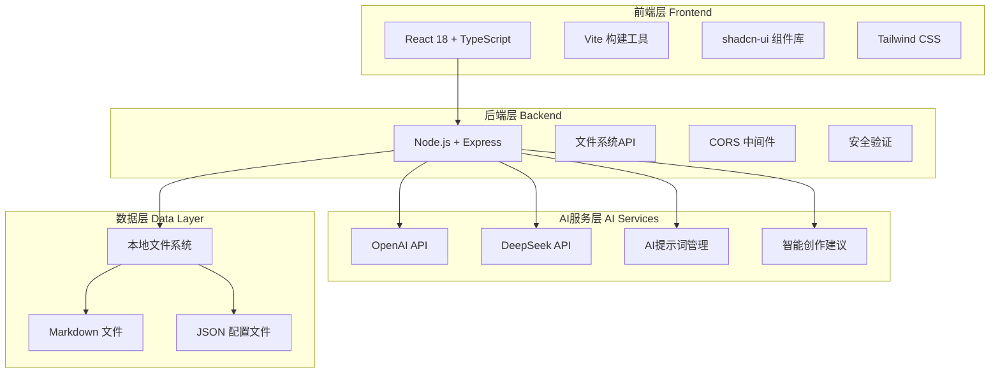
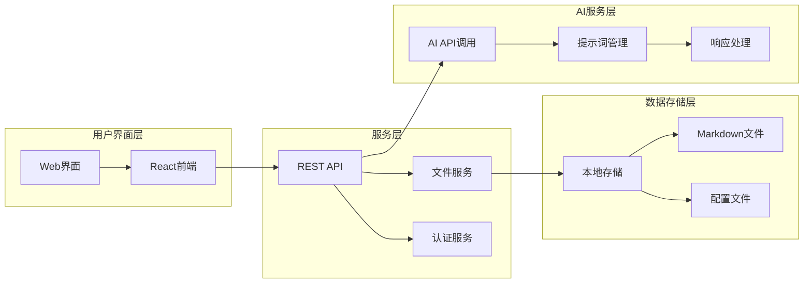
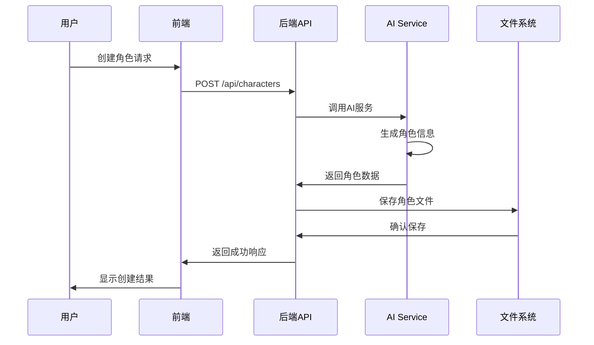

# Novel Writing AI - 小说写作AI助手

<div align="center">


**基于AI的智能小说创作助手**

[功能特性](#功能特性) • [技术架构](#技术架构) • [快速开始](#快速开始) • [API文档](#api文档) • [部署指南](#部署指南)

</div>

## 📖 项目简介

Novel Writing AI 是一个基于AI的智能小说创作助手，集成了前端React应用和Node.js后端服务。该系统能够帮助作者管理角色、构建世界观、组织章节内容，并提供智能创作建议。

### 🎯 核心功能

- 📚 **角色管理系统** - 创建、编辑、管理小说角色档案
- 🌍 **世界观构建工具** - 构建完整的小说世界观设定
- 📖 **章节内容管理** - 组织和管理小说章节结构
- 🤖 **AI智能创作辅助** - 多Agent协作提供创作建议
- 💾 **本地文件系统管理** - 安全的本地文件存储和管理
- 🔄 **实时协作编辑** - 支持多人实时协作编辑
- 📊 **创作进度跟踪** - 可视化创作进度和统计

## 🏗️ 技术架构

### 整体架构图



### 系统组件架构



### 数据流程图



## 🛠️ 技术栈

### 前端技术栈

| 技术 | 版本 | 用途 | 说明 |
|------|------|------|------|
| **React** | 18.3.1 | 前端框架 | 用户界面构建 |
| **TypeScript** | 5.8.3 | 类型系统 | 类型安全和开发体验 |
| **Vite** | 5.4.19 | 构建工具 | 快速开发和构建 |
| **Tailwind CSS** | 3.4.17 | CSS框架 | 样式管理 |
| **shadcn-ui** | Latest | UI组件库 | 现代化UI组件 |
| **React Router** | 6.30.1 | 路由管理 | 单页应用路由 |
| **React Query** | 5.83.0 | 状态管理 | 服务端状态管理 |
| **React Hook Form** | 7.61.1 | 表单管理 | 表单处理和验证 |
| **Zod** | 3.25.76 | 数据验证 | 运行时类型验证 |
| **Lucide React** | 0.462.0 | 图标库 | 现代化图标 |

### 后端技术栈

| 技术 | 版本 | 用途 | 说明 |
|------|------|------|------|
| **Node.js** | Latest | 运行时环境 | JavaScript服务端运行 |
| **Express** | 4.18.2 | Web框架 | HTTP服务器和路由 |
| **CORS** | 2.8.5 | 跨域处理 | 跨域资源共享 |
| **fs/promises** | Built-in | 文件系统 | 异步文件操作 |
| **path** | Built-in | 路径处理 | 文件路径操作 |

### AI服务技术栈

| 技术 | 版本 | 用途 | 说明 |
|------|------|------|------|
| **OpenAI API** | Latest | AI服务 | GPT大语言模型调用 |
| **DeepSeek API** | Latest | AI服务 | 国产大语言模型 |
| **HTTP Client** | Built-in | API调用 | 发送HTTP请求到AI服务 |
| **JSON处理** | Built-in | 数据格式 | 处理AI响应数据 |

### 开发工具

| 工具 | 版本 | 用途 | 说明 |
|------|------|------|------|
| **ESLint** | 9.32.0 | 代码检查 | JavaScript/TypeScript代码质量 |
| **PostCSS** | 8.5.6 | CSS处理 | CSS后处理 |
| **Autoprefixer** | 10.4.21 | CSS兼容 | 自动添加CSS前缀 |
| **Concurrently** | 7.6.0 | 进程管理 | 同时运行多个命令 |

## 🚀 快速开始

### 环境要求

- **Node.js**: >= 16.0.0
- **npm**: >= 8.0.0
- **Git**: >= 2.0.0

### 安装步骤

#### 1. 克隆项目

```bash
# 克隆仓库
git clone https://github.com/lvtiansama/novel-writing-ai.git

# 进入项目目录
cd novel-writing-ai
```

#### 2. 安装依赖

```bash
# 安装前端依赖
npm install

```

#### 3. 环境配置

创建环境配置文件：

```bash
# 创建.env文件
touch .env
```

在`.env`文件中添加以下配置：

```env
# 服务器配置
PORT=3001
DEBUG_LLM=1

# AI服务配置
OPENAI_API_KEY=your_openai_api_key
DEEPSEEK_API_KEY=your_deepseek_api_key

# 前端配置
VITE_API_BASE_URL=http://localhost:3001
```

### 启动方式

#### 方式一：使用启动脚本（推荐）

```bash
# Windows用户
start.bat

# Linux/Mac用户
chmod +x start.sh
./start.sh
```

#### 方式二：手动启动

**启动后端服务：**

```bash
# 启动Node.js后端
npm run server

# 或者使用concurrently同时启动前后端
npm run start
```

**启动前端服务：**

```bash
# 启动前端开发服务器
npm run dev
```


#### 方式三：开发模式启动

```bash
# 同时启动前后端（开发模式）
npm run dev:full

```

### 访问应用

启动成功后，访问以下地址：

- **前端应用**: http://localhost:5173
- **后端API**: http://localhost:3001

## 📁 项目结构

```
novel-writing-ai/
├── src/                       # 前端源码
│   ├── components/            # React组件
│   │   ├── ui/               # UI组件库
│   │   ├── ChatInterface.tsx # 聊天界面
│   │   ├── FileExplorer.tsx  # 文件浏览器
│   │   ├── TextEditor.tsx    # 文本编辑器
│   │   └── TitleBar.tsx      # 标题栏
│   ├── pages/                # 页面组件
│   │   ├── Index.tsx         # 主页
│   │   ├── ChatHome.tsx      # 聊天主页
│   │   ├── KeySettings.tsx   # 密钥设置
│   │   └── Welcome.tsx       # 欢迎页
│   ├── hooks/                # 自定义Hooks
│   ├── lib/                  # 工具库
│   └── main.tsx             # 应用入口
├── prompts/                  # AI提示词
│   ├── chat_prompts.js      # 聊天提示词
│   └── novel_prompts.js     # 小说创作提示词
├── public/                   # 静态资源
├── data/                     # 数据存储目录
├── server.js                 # 后端服务器
├── start.bat                 # 启动脚本
├── package.json              # 项目配置
├── vite.config.ts           # Vite配置
├── tailwind.config.ts       # Tailwind配置
└── README.md                # 项目说明
```

## 🔌 API文档

### 文件管理API

#### 获取文件列表
```http
GET /api/files
```

#### 读取文件内容
```http
GET /api/files/{path}
```

#### 保存文件内容
```http
PUT /api/files/{path}
Content-Type: application/json

{
  "content": "文件内容"
}
```

#### 创建文件/文件夹
```http
POST /api/files
Content-Type: application/json

{
  "path": "文件路径",
  "type": "file|folder",
  "content": "文件内容（可选）"
}
```

#### 删除文件/文件夹
```http
DELETE /api/files/{path}
```

#### 重命名文件/文件夹
```http
PATCH /api/files/{path}
Content-Type: application/json

{
  "newPath": "新路径"
}
```

### AI聊天API

#### 发送聊天消息
```http
POST /api/chat
Content-Type: application/json

{
  "message": "用户消息",
  "context": "上下文信息（可选）"
}
```

#### 获取聊天历史
```http
GET /api/chat/history
```

### 角色管理API

#### 创建角色
```http
POST /api/characters
Content-Type: application/json

{
  "name": "角色名称",
  "description": "角色描述",
  "attributes": {
    "age": 25,
    "gender": "男",
    "occupation": "学生"
  }
}
```

#### 获取角色列表
```http
GET /api/characters
```

#### 更新角色信息
```http
PUT /api/characters/{id}
Content-Type: application/json

{
  "name": "更新后的名称",
  "description": "更新后的描述"
}
```

## 🔧 配置说明

### 环境变量

| 变量名 | 说明 | 默认值 | 必需 |
|--------|------|--------|------|
| `PORT` | 后端服务端口 | 3001 | 否 |
| `DEBUG_LLM` | 调试模式 | 1 | 否 |
| `OPENAI_API_KEY` | OpenAI API密钥 | - | 是 |
| `DEEPSEEK_API_KEY` | DeepSeek API密钥 | - | 是 |
| `VITE_API_BASE_URL` | API基础URL | http://localhost:3001 | 否 |

### 文件配置

#### package.json 脚本说明

```json
{
  "scripts": {
    "dev": "vite --open",                    // 启动前端开发服务器
    "build": "vite build",                   // 构建生产版本
    "server": "node server.js",              // 启动后端服务器
    "start": "concurrently -k -n server,web -c green,cyan \"node server.js\" \"vite --open\"", // 同时启动前后端
    "lint": "eslint ."                       // 代码检查
  }
}
```

#### Vite配置

```typescript
// vite.config.ts
export default defineConfig({
  plugins: [react()],
  server: {
    port: 5173,
    proxy: {
      '/api': 'http://localhost:3001'
    }
  }
})
```

## 🚀 部署指南

### 本地部署

#### 1. 构建生产版本

```bash
# 构建前端
npm run build

# 构建后的文件在 dist/ 目录
```

#### 2. 启动生产服务

```bash
# 启动后端服务
npm run server

# 使用nginx或其他静态文件服务器托管dist目录
```

### Docker部署

#### 1. 创建Dockerfile

```dockerfile
# Dockerfile
FROM node:18-alpine

WORKDIR /app

COPY package*.json ./
RUN npm ci --only=production

COPY . .
RUN npm run build

EXPOSE 3001

CMD ["npm", "run", "server"]
```

#### 2. 构建和运行

```bash
# 构建镜像
docker build -t novel-writing-ai .

# 运行容器
docker run -p 3001:3001 novel-writing-ai
```

### 云服务部署

#### Vercel部署

```bash
# 安装Vercel CLI
npm i -g vercel

# 部署
vercel
```

#### Netlify部署

```bash
# 安装Netlify CLI
npm i -g netlify-cli

# 部署
netlify deploy --prod
```

## 🐛 故障排除

### 常见问题

#### 1. 端口被占用

**问题**: 启动时提示端口被占用

**解决方案**:
```bash
# 查看端口占用
netstat -ano | findstr :3001
netstat -ano | findstr :5173

# 杀死占用进程
taskkill /PID <进程ID> /F
```

#### 2. 依赖安装失败

**问题**: npm install 失败

**解决方案**:
```bash
# 清理缓存
npm cache clean --force

# 删除node_modules重新安装
rm -rf node_modules
npm install
```

#### 3. AI服务连接失败

**问题**: AI Agent无法连接

**解决方案**:
- 检查API密钥是否正确配置
- 确认网络连接正常
- 查看服务器日志排查错误

#### 4. 文件权限问题

**问题**: 无法创建或修改文件

**解决方案**:
```bash
# Linux/Mac用户
chmod -R 755 data/

# Windows用户以管理员身份运行
```

### 调试模式

启用调试模式：

```bash
# 设置环境变量
export DEBUG_LLM=1

# 或修改.env文件
DEBUG_LLM=1
```

## 🤝 贡献指南

### 开发流程

1. Fork 项目
2. 创建功能分支 (`git checkout -b feature/AmazingFeature`)
3. 提交更改 (`git commit -m 'Add some AmazingFeature'`)
4. 推送到分支 (`git push origin feature/AmazingFeature`)
5. 打开 Pull Request

### 代码规范

- 使用 ESLint 进行代码检查
- 遵循 TypeScript 严格模式
- 使用 Prettier 格式化代码
- 编写单元测试

### 提交规范

使用 Conventional Commits 规范：

```
feat: 新功能
fix: 修复bug
docs: 文档更新
style: 代码格式调整
refactor: 代码重构
test: 测试相关
chore: 构建过程或辅助工具的变动
```

## 📄 许可证

本项目采用 MIT 许可证 - 查看 [LICENSE](LICENSE) 文件了解详情。

## 🙏 致谢

- [React](https://reactjs.org/) - 前端框架
- [Vite](https://vitejs.dev/) - 构建工具
- [shadcn/ui](https://ui.shadcn.com/) - UI组件库
- [Tailwind CSS](https://tailwindcss.com/) - CSS框架
- [OpenAI](https://openai.com/) - AI服务提供商

## 📞 联系方式

- **项目链接**: [https://github.com/lvtiansama/novel-writing-ai](https://github.com/lvtiansama/novel-writing-ai)
- **问题反馈**: [Issues](https://github.com/lvtiansama/novel-writing-ai/issues)
- **功能建议**: [Discussions](https://github.com/lvtiansama/novel-writing-ai/discussions)

---

<div align="center">

**⭐ 如果这个项目对您有帮助，请给它一个星标！**

Made with ❤️ by [lvtiansama](https://github.com/lvtiansama)

</div>