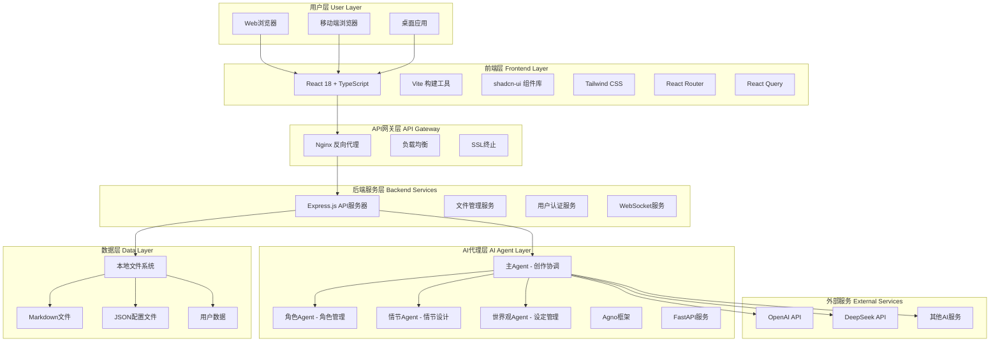
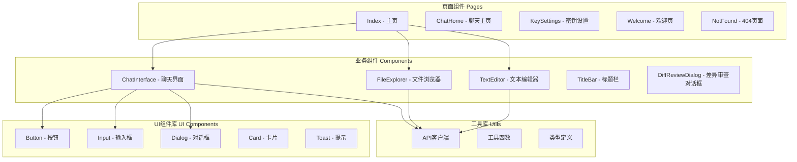
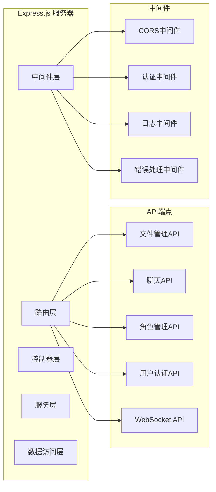
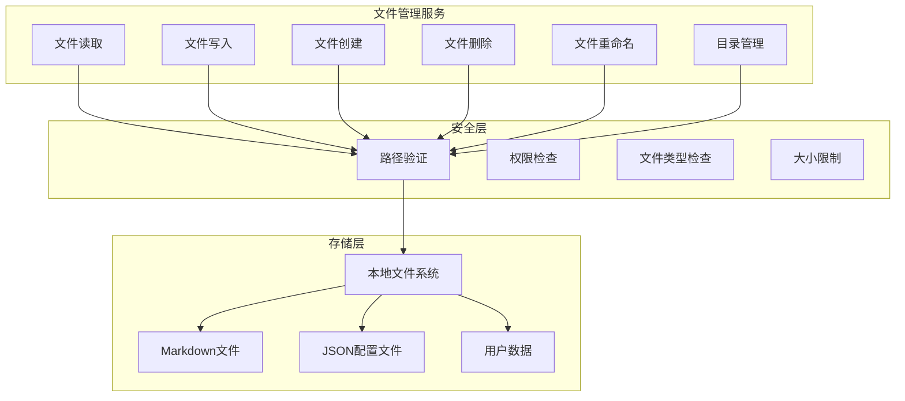
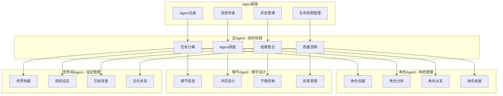
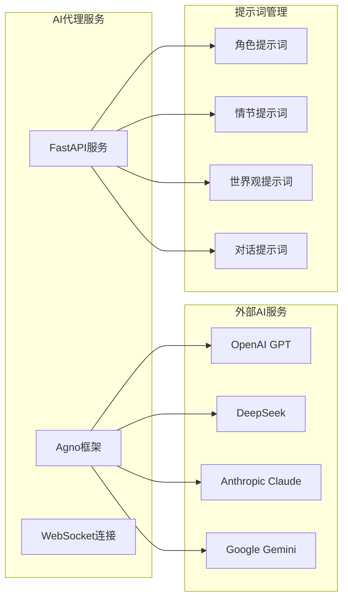
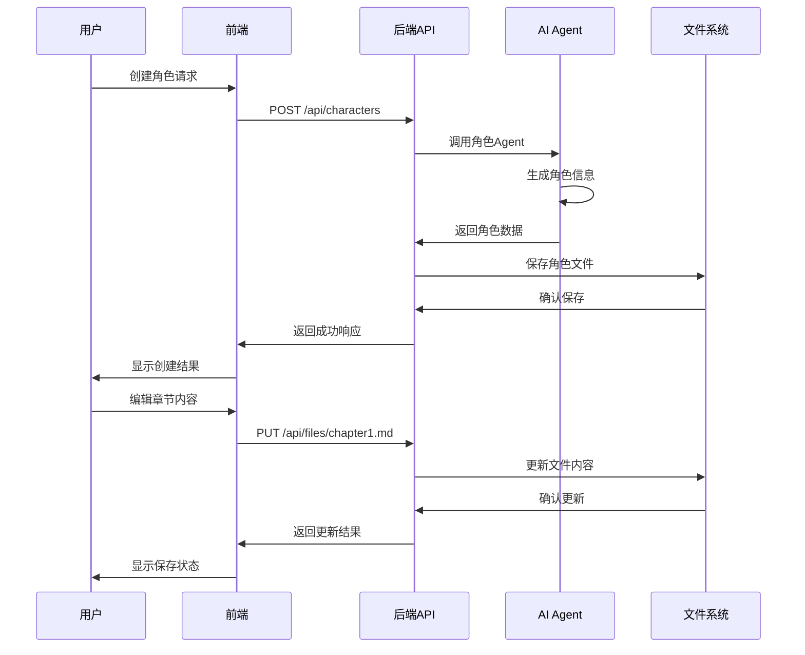
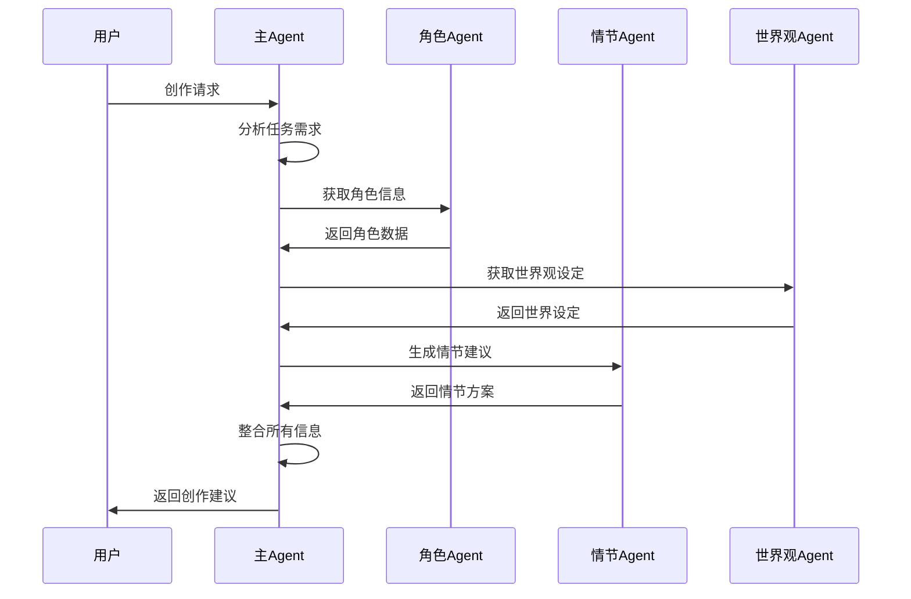
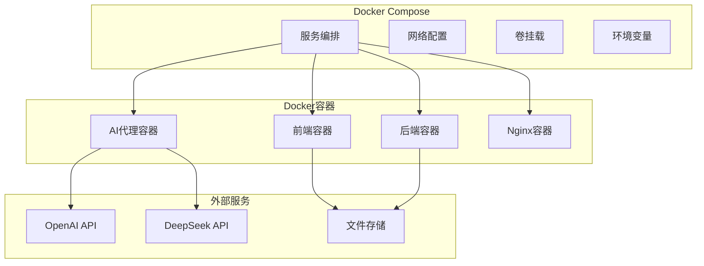
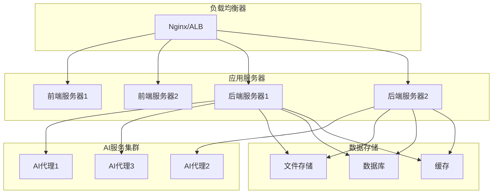

# Novel Writing AI 架构文档

## 系统架构概览

### 整体架构图

## 详细架构说明

### 1. 前端架构

#### 技术栈
- **React 18**: 现代化的前端框架，支持并发特性
- **TypeScript**: 提供类型安全和更好的开发体验
- **Vite**: 快速的构建工具和开发服务器
- **shadcn-ui**: 高质量的UI组件库
- **Tailwind CSS**: 实用优先的CSS框架
- **React Router**: 客户端路由管理
- **React Query**: 服务端状态管理和缓存

#### 组件架构

### 2. 后端架构

#### 服务架构

#### 文件管理服务

### 3. AI代理架构

#### 多Agent协作架构

#### AI服务集成

### 4. 数据流架构

#### 用户交互流程

#### AI协作流程

### 5. 部署架构

#### 容器化部署

#### 云部署架构

## 技术选型说明

### 前端技术选型

1. **React 18**: 选择React是因为其生态丰富、社区活跃，18版本提供了并发特性，提升用户体验
2. **TypeScript**: 提供类型安全，减少运行时错误，提升开发效率
3. **Vite**: 相比Webpack更快的构建速度，更好的开发体验
4. **shadcn-ui**: 高质量的组件库，可定制性强
5. **Tailwind CSS**: 实用优先的CSS框架，开发效率高

### 后端技术选型

1. **Node.js + Express**: JavaScript全栈开发，前后端技术栈统一
2. **文件系统存储**: 简单直接，适合个人项目，易于备份和迁移
3. **CORS支持**: 支持跨域请求，便于前后端分离部署

### AI代理技术选型

1. **Agno框架**: 专门为多Agent协作设计的框架
2. **FastAPI**: 高性能的Python Web框架，适合AI服务
3. **多Agent架构**: 职责分离，提高系统的可维护性和扩展性

### 部署技术选型

1. **Docker**: 容器化部署，环境一致性
2. **Docker Compose**: 服务编排，简化部署流程
3. **Nginx**: 反向代理，负载均衡，SSL终止

## 性能优化策略

### 前端优化

1. **代码分割**: 使用React.lazy()进行路由级别的代码分割
2. **缓存策略**: 使用React Query进行数据缓存
3. **图片优化**: 使用WebP格式，懒加载
4. **Bundle优化**: 使用Vite的代码分割和Tree Shaking

### 后端优化

1. **文件缓存**: 实现文件内容缓存，减少磁盘IO
2. **API缓存**: 使用Redis缓存频繁访问的数据
3. **压缩**: 启用Gzip压缩，减少传输数据量
4. **连接池**: 使用连接池管理数据库连接

### AI服务优化

1. **请求批处理**: 批量处理AI请求，提高效率
2. **结果缓存**: 缓存AI生成的结果，避免重复计算
3. **异步处理**: 使用异步处理长时间运行的AI任务
4. **负载均衡**: 多个AI代理实例，提高并发处理能力

## 安全考虑

### 数据安全

1. **文件路径验证**: 防止目录遍历攻击
2. **文件类型检查**: 限制可上传的文件类型
3. **大小限制**: 限制文件大小，防止资源耗尽
4. **权限控制**: 实现用户权限管理

### API安全

1. **CORS配置**: 正确配置跨域资源共享
2. **请求验证**: 验证所有输入数据
3. **错误处理**: 不暴露敏感信息
4. **日志记录**: 记录安全相关事件

### AI服务安全

1. **API密钥管理**: 安全存储和使用API密钥
2. **输入过滤**: 过滤恶意输入，防止提示词注入
3. **输出验证**: 验证AI输出内容的安全性
4. **访问控制**: 限制AI服务的访问权限
